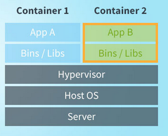

# Dokumentation M300 LB03
## Von Karim Darwiche

## Inhaltsverzeichnis

  - [K1](#k1)
  - [K2](#k2)
    - [Containerisierung / Docker](#containisierung-docker)
    - [Microservices](#microservices)
  - [K3](#k3)
    - [Bestehender Docker implementieren](#bestehender-docker)
    - [Docker Container](#docker-container)
    - [Docker Befehle](#docker-befehle)
    - [Eingerichtet Umgebung](#eingerichtete-umgebung)
    - [Schichtenmodell](#schichtenmodell)
  - [K4](#k4)
    - [Service-Überwachung & Benachrichtigung](#service-benachrichtung)
    - [Container Absicherung](#container-absicherung)
    - [Sicherheitsmassnahmen](#sicherheitsmassnahmen)


## K1
Auf meinem Notebook habe ich die folgenden Programme eingerichtet:
1. VirtualBox (inkl. Ubuntu VM)
2. Vagrant
3. Visualstudio-Code
4. Git-Client
5. SSH-Key für Client erstellt

## K2
### Persönlicher Wissenstand
#### Containisierung / Docker
Docker ist eine Virtualisierung ohne Virtualisierung. Die Technik dahinter heisst Containerisierung.

Container benötigen weniger Ressourcen als virtuelle Maschinen, da sie auf das Starten eines eigenen Betriebssystems verzichten und stattdessen im Kontext des Host-Betriebssystems laufen. Trotzdem sind die Container gegeneinander und vom Host-System abgeschottet, wenn auch nicht so stark, wie bei einer Virtualisierung.
Docker-Container werden aus einem Container-Image gestartet, das als einfache Datei leicht von einem System auf ein anderes übertragbar ist. Installation, Update und Deinstallation einer Software reduziert sich daher auf einen einfachen Kopiervorgang beziehungsweise eine einzelne Dateilöschung.

#### Microservices
Microservices sind ein Architekturkonzept der Anwendungsentwicklung. Was sie von herkömmlichen Ansätzen unterscheidet, ist die Art und Weise, wie Apps in ihre Kernfunktionen aufgeschlüsselt werden. Jede Funktion bzw. jeder Service kann unabhängig entwickelt und implementiert werden. Das heißt, individuelle Services können ohne jegliche Beeinflussung anderer Services funktionieren (oder auch nicht).

## K3
### Bestehender Docker implementieren
Ich habe mich dafür entschieden, den bereits bestehenden Docker zu nehmen und zu dokumentieren. In K4 werden dann auf diesem Docker Sicherheitsapsekte implementiert.

### Docker Container

Als Container habe ich Apache2 installiert.
Dies habe ich mit dem Befehl `docker build -t apache .` gemacht.

Danach habe ich den Container gestartet: `docker run --rm -d -p 8080:80 -v `pwd`/web:/var/www/html --name apache apache`

Getestet habe ich das ganze mit curl `http://localhost:8080`
Als Test habe ich am index.html etwas angepasst und den curl nochmals ausgeführt.

  


### Docker Befehle
#### Meistgenutzt
| Command           | Beschreibung                                                                   |
|-------------------|-------------------------------------------------------------------------------|
| FROM    | Welches Image als Grundlage verwendet werden soll |
| RUN     | Auszuführende Befehle                             |
| ENV     | Umgebungsvariable setzen                          |
| EXPOSE  | Port freigeben                                    |
| VOLUME  | Ordner freigeben                                  |
| CMD     | Befehl beim Start ausführen                       |

#### Alle Befehle
| Command           | Beschreibung                                                                   |
|-------------------|-------------------------------------------------------------------------------|
| docker attach     | Attach local standard input, output, and error streams to a running container |
| docker build      | Build an image from a Dockerfile                                              |
| docker builder    | Manage builds                                                                 |
| docker checkpoint | Manage checkpoints                                                            |
| docker commit     | Create a new image from a container’s changes                                 |
| docker config     | Manage Docker configs                                                         |
| docker container  | Manage containers                                                             |
| docker context    | Manage contexts                                                               |
| docker cp         | Copy files/folders between a container and the local filesystem               |
| docker create     | Create a new container                                                        |
| docker diff       | Inspect changes to files or directories on a container’s filesystem           |
| docker events     | Get real time events from the server                                          |
| docker exec       | Run a command in a running container                                          |
| docker export     | Export a container’s filesystem as a tar archive                              |
| docker history    | Show the history of an image                                                  |
| docker image      | Manage images                                                                 |
| docker images     | List images                                                                   |
| docker import     | Import the contents from a tarball to create a filesystem image               |
| docker info       | Display system-wide information                                               |
| docker inspect    | Return low-level information on Docker objects                                |
| docker kill       | Kill one or more running containers                                           |
| docker load       | Load an image from a tar archive or STDIN                                     |
| docker login      | Log in to a Docker registry                                                   |
| docker logout     | Log out from a Docker registry                                                |
| docker logs       | Fetch the logs of a container                                                 |
| docker manifest   | Manage Docker image manifests and manifest lists                              |
| docker network    | Manage networks                                                               |
| docker node       | Manage Swarm nodes                                                            |
| docker pause      | Pause all processes within one or more containers                             |
| docker plugin     | Manage plugins                                                                |
| docker port       | List port mappings or a specific mapping for the container                    |
| docker ps         | List containers                                                               |
| docker pull       | Pull an image or a repository from a registry                                 |
| docker push       | Push an image or a repository to a registry                                   |
| docker rename     | Rename a container                                                            |
| docker restart    | Restart one or more containers                                                |
| docker rm         | Remove one or more containers                                                 |
| docker rmi        | Remove one or more images                                                     |
| docker run        | Run a command in a new container                                              |
| docker save       | Save one or more images to a tar archive (streamed to STDOUT by default)      |
| docker search     | Search the Docker Hub for images                                              |
| docker secret     | Manage Docker secrets                                                         |
| docker service    | Manage services                                                               |
| docker stack      | Manage Docker stacks                                                          |
| docker start      | Start one or more stopped containers                                          |
| docker stats      | Display a live stream of container(s) resource usage statistics               |
| docker stop       | Stop one or more running containers                                           |
| docker swarm      | Manage Swarm                                                                  |
| docker system     | Manage Docker                                                                 |
| docker tag        | Create a tag TARGET_IMAGE that refers to SOURCE_IMAGE                         |
| docker top        | Display the running processes of a container                                  |
| docker trust      | Manage trust on Docker images                                                 |
| docker unpause    | Unpause all processes within one or more containers                           |
| docker update     | Update configuration of one or more containers                                |
| docker version    | Show the Docker version information                                           |
| docker volume     | Manage volumes                                                                |
| docker wait       | Block until one or more containers stop, then print their exit codes          |

### Eingerichtet Umgebung
Ich habe eine Dockerumgebung genommen, darauf Apache mithilfe eines Dockerfiles installiert und daraufhin dort ein Monitoring mithilfe von cAdvisor aktiviert.
Zudem habe ich zahlreiche Sicherheitsfeatures implementiert, um das System sicherer zu machen.

#### Netzwerkplan


#### Schichtenmodell
  
Während eine VM jedoch ein vollständiges Betriebssystem sowie Applikationen enthält, teilen sich Container einen Betriebssystemkern mit anderen Containern. Jede Anwendung erhält lediglich einen neuen User Space und damit eine komplett isolierte Umgebung.

## K4
### Service-Überwachung & Benachrichtigung
Um dies zu erfüllen, habe ich cadivsor installiert. Dazu habe ich dieses Installationsscript verwendet (direkt GitHub cAdvisor):

```
VERSION=v0.36.0 # use the latest release version from https://github.com/google/cadvisor/releases
sudo docker run \
  --volume=/:/rootfs:ro \
  --volume=/var/run:/var/run:ro \
  --volume=/sys:/sys:ro \
  --volume=/var/lib/docker/:/var/lib/docker:ro \
  --volume=/dev/disk/:/dev/disk:ro \
  --publish=8080:8081 \
  --detach=true \
  --name=cadvisor \
  --privileged \
  --device=/dev/kmsg \
  gcr.io/google-containers/cadvisor:$VERSION
```

### Container Absicherung
Zur Container Absicherung habe ich drei Sicherungsmethoden eingefügt.
  
"Services wie z.B. Apache, Mysql ist mir irgendeiner Form der Zugriffskontrolle oder einem Passwortschutz ausgestattet."
- Dies habe ich so gelöst, dass ich eine Gruppe für Webadministratoren erstellt habe. Und die Gruppe nur auf diesen Ordner "Apache" berechtigt habe.
  
AppArmor oder SELinux sind auf dem Host aktiviert
- AppArmor: Dies habe ich im grub.d entsprechend aktiviert.
- SELinux: Zuerst habe ich die selinux-policy-default und dazugehörige Packete installiert und dannach entsprechend aktiviert.
    

"Alle Container laufen mit aktueller Software und im Produktivmodus – Debug-Informationen sind abgeschaltet."
-  Um die Debug-Informationen abzuschalten habe ich ein neues File angelegt: `/etc/docker/daemon.json`
-  Danach habe ich im File die Zeile `"debug": false` angegeben, um das Debuggen auszuschalten.
  


### Sicherheitsmassnahmen

1. Durch die obrige Option von SELinux werden erstmal alle Verbindung 'denied', die nicht benötigt werden. Der Netzwerkzugriff ist dadurch beschränkt und es sind nur die Ports offen, die auch wirklich benötigt werden.

2. Um mich vor DoSAngriffen und schlecht programmierten Anwendungen zu schützen, habe ich den Speicher begrenzt.
   `docker run -m 128m --memory-swap 128m amouat/stress stress --vm 1 --vm-bytes 127m -t 5s`

3. Auch habe ich den CPU-Einsatz beschränkt, sodass Angreifer nicht einen vollständigen Container auslasten können.
   `docker run -d --name apache -c 2048 amouat/stress`

4. Der Neustart wurde begrenzt. Falls ein Container in eine Dauerschleife von Neustarts kommt, kann ein unaufhaltsames Neustarten dadurch verhindert werden.
   `docker run -d --restart=on-failure:10 apache`

